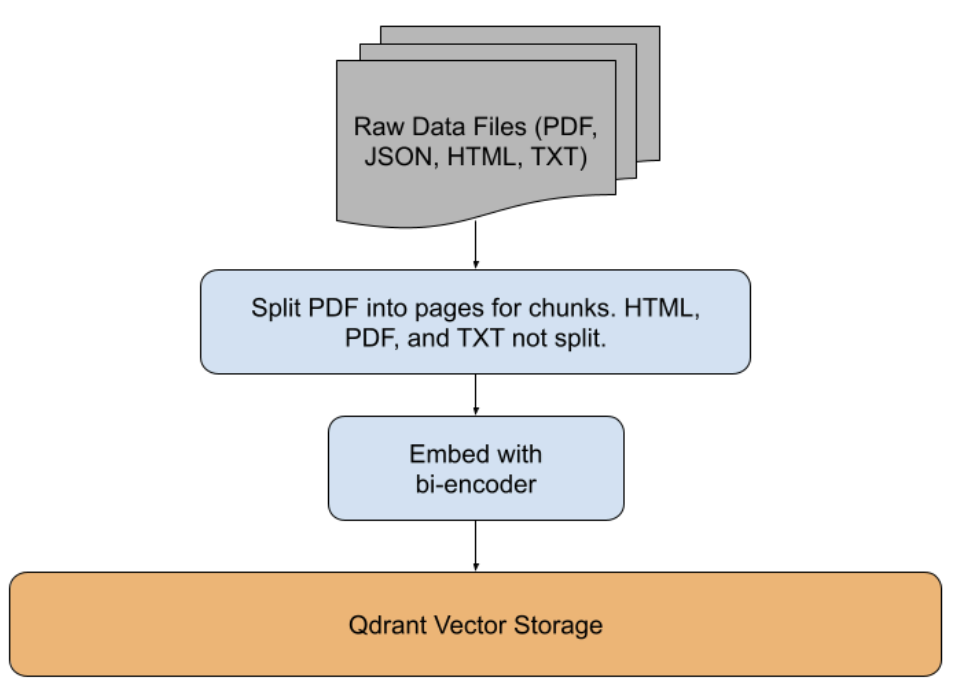
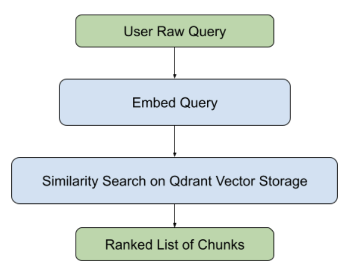

# phase 1
files in this directory are related to phase 1, using qdrant by itself to perform RAG.

## running with custom queries
1. modify the `QUERIES` variable in `phase_1_pipeline/inference.py` with your queries
2. run `python phase_1_pipeline/inference.py` to run the pipeline, see results in `phase_1_pipeline/results/`

## data upload pipeline

## inference pipeline
