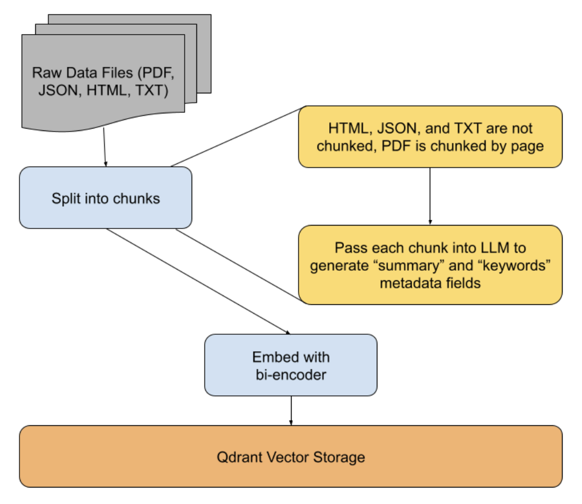
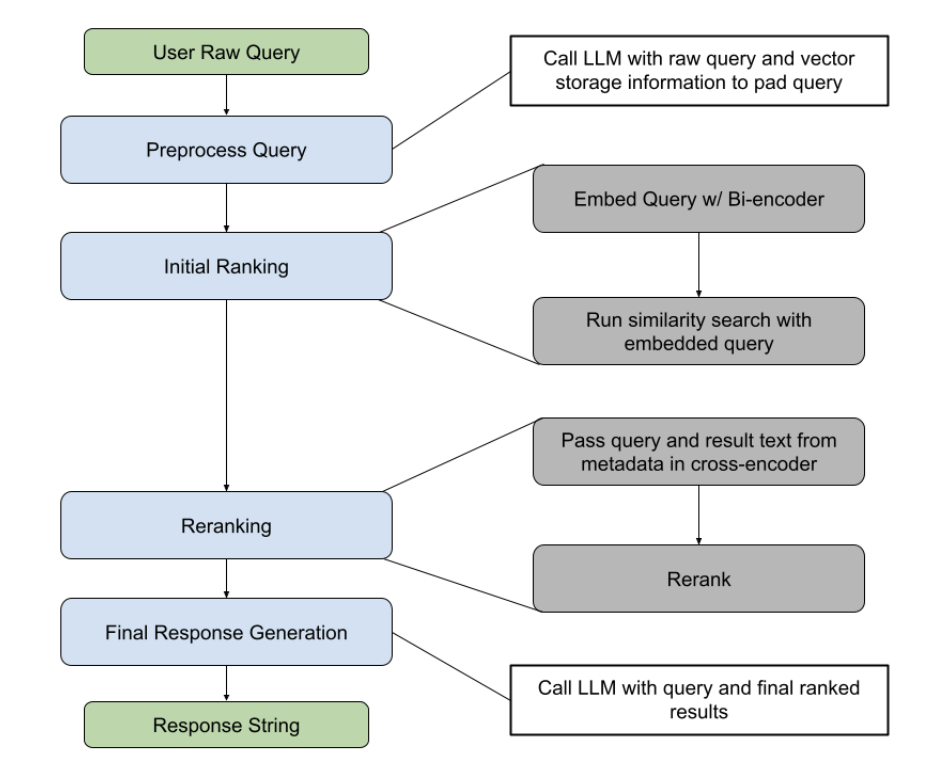

# phase 2

## running with custom queries
1. modify the `QUERIES` variable in `phase_2_pipeline/p0_runner.py` with your queries
2. run `python phase_2_pipeline/p0_runner.py` to run the pipeline, see results in `phase_2_pipeline/results/`

## data upload pipeline

## inference pipeline
